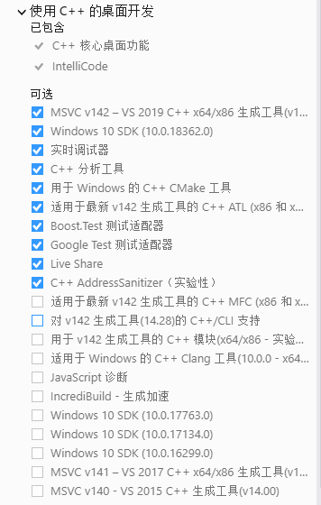
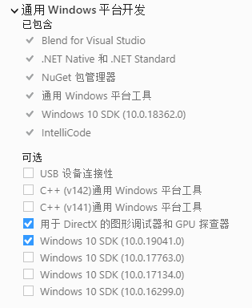

```sh
$ npm i -g node-gyp windows-build-tools

$ npm i
$ npm run c
$ npm run bt
```

要是已经安装了vs2019和python没必要安装windows-build-tools


## 去函数体

将.h文件拷贝到.d.ts中时

https://stackoverflow.com/questions/38110833/match-the-body-of-a-function-using-regex
```
(\w*\s[^{};]*)\n^\{($[^}$]*)\}$

$1
```

## .gyp 文件

预定义变量 https://gyp.gsrc.io/docs/InputFormatReference.md#Variables-and-Conditionals
```
PRODUCT_DIR        -> <project-dir>\build\Release

INTERMEDIATE_DIR    -> Release\obj\node-windows-x64\

module_root_dir   -> <project-dir>
```

## vs2019 组件






## api函数使用宏替换
```
Napi::Value ([\w:]+)\(const Napi::CallbackInfo &info\)

nm_api($1)
```

```
void ([\w:]+)\(const Napi::CallbackInfo &info, const Napi::Value &value\)

nm_sapi($1)
```